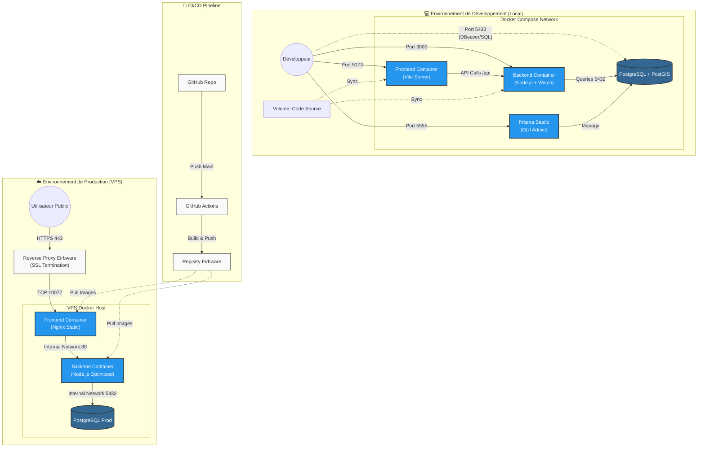

```mermaid
graph TD
    subgraph "💻 Environnement de Développement (Local)"
        dev_user((Développeur))

        subgraph "Docker Compose Network"
            dev_front["Frontend Container<br/>(Vite Server)"]
            dev_back["Backend Container<br/>(Node.js + Watch)"]
            dev_db[("PostgreSQL + PostGIS")]
            dev_studio["Prisma Studio<br/>(GUI Admin)"]
        end

        dev_user -->|Port 5173| dev_front
        dev_user -->|Port 5555| dev_studio
        dev_user -->|Port 3000| dev_back
        dev_user -.->|"Port 5433<br/>(DBeaver/SQL)"| dev_db

        dev_front -->|"API Calls /api"| dev_back
        dev_back -->|"Queries 5432"| dev_db
        dev_studio -->|Manage| dev_db

        %% Volumes
        dev_vol_code[Volume: Code Source] -.->|Sync| dev_front
        dev_vol_code -.->|Sync| dev_back
    end

    subgraph "☁️ Environnement de Production (VPS)"
        internet((Utilisateur Public))
        school_proxy["Reverse Proxy Eirbware<br/>(SSL Termination)"]

        subgraph "VPS Docker Host"
            prod_nginx["Frontend Container<br/>(Nginx Static)"]
            prod_back["Backend Container<br/>(Node.js Optimized)"]
            prod_db[("PostgreSQL Prod")]
        end

        internet -->|"HTTPS 443"| school_proxy
        school_proxy -->|"TCP 10077"| prod_nginx

        prod_nginx -->|"Internal Network:80"| prod_back
        prod_back -->|"Internal Network:5432"| prod_db
    end

    subgraph "🔄 CI/CD Pipeline"
        git[GitHub Repo]
        actions[GitHub Actions]
        registry[Registry Eirbware]

        git -->|Push Main| actions
        actions -->|Build & Push| registry
        registry -.->|Pull Images| prod_nginx
        registry -.->|Pull Images| prod_back
    end

    classDef docker fill:#2496ed,stroke:#333,stroke-width:2px,color:white;
    classDef db fill:#336791,stroke:#333,stroke-width:2px,color:white;
    classDef ext fill:#f9f9f9,stroke:#333,stroke-width:1px;

    class dev_front,dev_back,dev_studio,prod_nginx,prod_back docker;
    class dev_db,prod_db db;
    class school_proxy,registry,git,actions ext;
```
