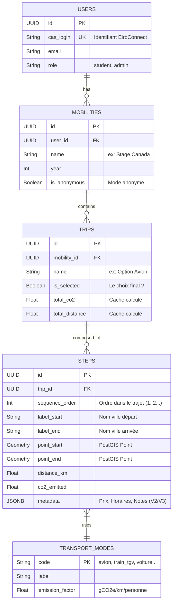

```mermaid
erDiagram
    USERS ||--o{ MOBILITIES : has
    MOBILITIES ||--o{ TRIPS : contains
    TRIPS ||--o{ STEPS : composed_of
    STEPS }|--|| TRANSPORT_MODES : uses

    USERS {
        UUID id PK
        String cas_login UK "Identifiant EirbConnect"
        String email
        String role "student, admin"
    }

    MOBILITIES {
        UUID id PK
        UUID user_id FK
        String name "ex: Stage Canada"
        Int year
        Boolean is_anonymous "Mode anonyme"
    }

    TRIPS {
        UUID id PK
        UUID mobility_id FK
        String name "ex: Option Avion"
        Boolean is_selected "Le choix final ?"
        Float total_co2 "Cache calculé"
        Float total_distance "Cache calculé"
    }

    STEPS {
        UUID id PK
        UUID trip_id FK
        Int sequence_order "Ordre dans le trajet (1, 2...)"
        String label_start "Nom ville départ"
        String label_end "Nom ville arrivée"
        Geometry point_start "PostGIS Point"
        Geometry point_end "PostGIS Point"
        Float distance_km
        Float co2_emitted
        JSONB metadata "Prix, Horaires, Notes (V2/V3)"
    }

    TRANSPORT_MODES {
        String code PK "avion, train_tgv, voiture..."
        String label
        Float emission_factor "gCO2e/km/personne"
    }
```
